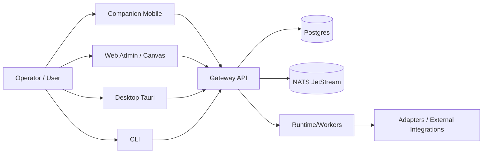
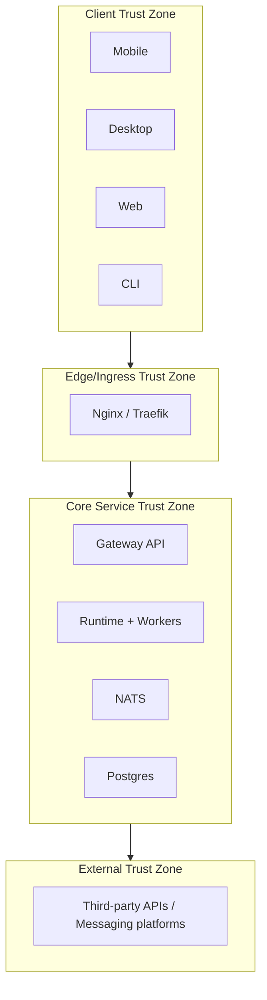

# System Diagrams and Trust Boundaries (2026)

Date: 2026-02-13

## 1) High-Level Runtime Topology

## 2) Trust Zones

## 3) Primary Trust Boundaries

- Boundary A: client devices -> edge ingress
- Boundary B: ingress -> gateway-api
- Boundary C: gateway-api -> data plane (Postgres/NATS)
- Boundary D: core services -> external integrations

## 4) Security Controls by Boundary

- Boundary A:
  - TLS-only external transport
  - session/bootstrap auth controls
  - rate limiting and ingress abuse controls
- Boundary B:
  - trusted proxy headers and strict host routing
  - ACME challenge isolation
- Boundary C:
  - service-authenticated internal calls
  - least-privilege DB and message-bus access
- Boundary D:
  - allowlist/policy gates before egress actions
  - approval and audit trails for high-risk actions

## 5) Data Class Mapping

- Secrets/tokens:
  - must stay in secure storage on clients; never persisted plaintext.
- Operational metadata:
  - service health, approvals, audit references.
- User/content data:
  - chat/timeline payloads, subject to retention and privacy controls.
